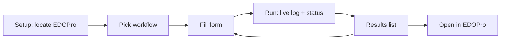
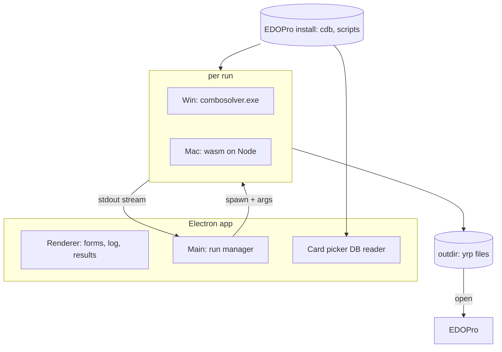

# PRD: ygo-combo-solver GUI

| Status | Author | Date | Tracking | Related |
| --- | --- | --- | --- | --- |
| Draft | Andy (with Claude) | 2026-08-30 | [YGO-5](https://linear.app/ygo-combo-solver-gui/issue/YGO-5/write-prd-for-cross-platform-ygo-combo-solver-gui) | [ygo-combo-solver](https://github.com/Armytille/ygo-combo-solver) |

## 1. Summary

[ygo-combo-solver](https://github.com/Armytille/ygo-combo-solver) is a command-line tool that searches for Yu-Gi-Oh! combo lines: given an EDOPro replay (and optionally a different decklist, opening hand, or hand-described target board), it finds alternative move sequences that reach the same end board — cheaper lines, lines from different hands, lines that survive interruption — and writes them out as `.yrp` replays that open in EDOPro. It is powerful but hard to drive: 124 CLI flags, a constraint mini-grammar, an environment variable for configuration, and plain-text console output.

This project builds a desktop GUI for the solver targeting **macOS and Windows**. The bar is *functional and easy to use*, not fancy: pick a replay, pick what to search for, watch progress, get playable results — without memorizing flags.

## 2. Goals and non-goals

### Goals

1. Let a user run the solver's common workflows end to end without touching a terminal.
2. Run on macOS and Windows from a single codebase.
3. Make the solver's implicit requirements explicit in the UI: EDOPro install location, card-script/replay version matching, run health checks.
4. Present results usably: ranked solution list with costs, one click to open a solution in EDOPro.
5. Never block access to solver power: every flag remains reachable via an advanced "extra arguments" escape hatch.

### Non-goals

- Reimplementing any solver logic in the GUI. The GUI drives the existing solver as a black box.
- A deck editor, replay recorder, or card viewer beyond what the workflows need. EDOPro already does these.
- Mobile or web-hosted deployment. (A hosted deployment would additionally trigger AGPL network-source obligations; see §9.)
- Visual polish beyond clean, native-feeling defaults.

## 3. Users

| User | Situation | Needs |
| --- | --- | --- |
| Competitive/ladder player | Has a replay of their combo; wants a cheaper line or a line from a worse hand | Simple "load replay → solve → open result" loop |
| Deck builder / theory-crafter | Wants to know if a board is reachable from a decklist at all | Board/hand description entry without learning the constraint grammar |
| Content creator / judge | Wants to verify a claimed line is legal, or prove a line holds against a handtrap | Verification and interruption-test workflows with clear verdicts |

All users are assumed to already have EDOPro (Project Ignis) installed, since the solver reads its card databases and scripts and its outputs are EDOPro replays.

## 4. Background: what the solver gives us to work with

Facts about the solver that constrain the GUI design (from a survey of the repo at `fd5d30e`):

- **Invocation**: `combosolver.exe <replay.yrpX> [options]` — one positional replay argument whose role changes with flags (`--solve`, `--deck`, `--start`, `--no-ref --target …`). 124 flags total; roughly a dozen matter for common use (`--solve-ms`, `--outdir`, `--deck`, `--hand`, `--target`, `--threads`, `--seed`, `--fire`, `--guard`, `--optimize`, `--workdir`, `--scriptdir`).
- **Configuration**: no config file. One environment variable, `COMBOSOLVER_WORKDIR`, points at the EDOPro install; `--workdir` overrides. Without either the run refuses to start.
- **Inputs**: `.yrpX`/`.yrp1` replays, `.ydk` decklists, EDOPro `.cdb` SQLite card databases, EDOPro Lua card scripts. Cards are referenced by passcode or unique name fragment; ambiguity is a hard error listing candidates.
- **Output**: plain-ASCII, line-oriented, *unbuffered* stdout (good for live streaming into a log view) with stable `--- section ---` markers, but **no JSON, no progress percentage, no machine-readable format**. Result artifacts are `.yrp` files in `--outdir` with cost encoded in the filename (`solution_00_b1_a9.yrp` = rank 0, 1 card burned, 9 actions), plus `best_approach_*.yrp` partials and `but_rejete_*.yrp` rejected witnesses.
- **Runtime**: default budget 2 minutes (`--solve-ms 120000`); documented workloads run 5–60 minutes. The search is anytime (best-so-far written at budget expiry) and non-deterministic run to run unless pinned with `--threads 1 --seed N --max-rollouts N`.
- **No cancellation hook**: the solver has no graceful-stop mechanism. Killing the process loses all results, because solutions are written only at the end of a phase.
- **Health gate**: a replay only reproduces under the card scripts contemporary with its recording. Under a mismatched script set the run silently continues on a *different duel*. The tell is the report line `MSG_RETRY: 0` (healthy) vs non-zero (broken). The solver also marks ineffective flags `!! INERT`.
- **Exit codes**: `0` ok, `2` usage error, `1` load or health failure.
- **Platforms**: the shipped binary is Windows x64 only. One file (`arena.cpp`, the snapshot allocator) hard-depends on Windows memory APIs (`VirtualAlloc`, `GetWriteWatch`). However, a complete **WebAssembly port exists** (local `web` branch, commit `c9b9821`): all 57 translation units compile under clang/emscripten, run at 0.88× native throughput, and the port's **Node target (`NODERAWFS`) runs on macOS today** with the identical CLI, reading a real EDOPro install from disk.
- **License**: AGPL-3.0-or-later (statically links ocgcore).

## 5. Product scope

### 5.1 Workflows (MVP)

The solver's README documents 14 tasks. The GUI's MVP exposes the five that cover the core value, each as a guided form:

| Workflow | Solver usage | GUI form |
| --- | --- | --- |
| **Verify a replay** | replay, no `--solve` | Pick replay → run → health verdict (MSG_RETRY, self-checks) + line cost summary. The recommended first step for any new replay; the UI nudges this before other workflows. |
| **Find a cheaper line** | `--solve --optimize` | Pick verified replay → set time budget → run |
| **Solve from another deck/hand** | `--deck`, `--hand` | Pick reference replay + `.ydk` file → optionally specify opening hand via card picker → run |
| **Build a described board** | `--no-ref --target …` + `--board-add`/`--board-remove` | Pick template replay + deck → compose target board with card picker (card + zone + position) → run |
| **Test against interruption** | `--fire`, `--opp-hand`, `--guard` | Pick replay → pick the opponent's card(s) → run → per-window verdict |

Everything else (goal decomposition knobs, NRPA tuning, diagnostics like `--width`/`--operators`, multi-round `--carry` runs, `--adapt` reuse) stays out of MVP forms but remains reachable via the extra-arguments field (§5.2.7).

### 5.2 Feature requirements (MVP)

#### 5.2.1 First-run setup

- Detect or ask for the EDOPro install directory; validate it (non-empty `cards.cdb`, script directories present) and store it in GUI settings. Pass it as `--workdir` on every run — the GUI never depends on the user having set `COMBOSOLVER_WORKDIR`.
- Locate the solver binary/runtime (bundled by default, see §7; overridable path in settings for users with their own build).
- Optional: script-directory override (`--scriptdir`) per run, for replays recorded under older card scripts.

#### 5.2.2 Run configuration

- One form per workflow (§5.1) exposing only that workflow's relevant options, pre-filled with solver defaults.
- Common controls on every form: time budget (with presets: 2 min default / 10 min / 1 hour), output directory (default per-run subfolder), threads, seed (blank = random; the seed used is always displayed after the run for reproducibility).
- Validation before launch: file paths exist, mutually exclusive options blocked (`--deck` vs `--start`), budget sanity.

#### 5.2.3 Card picker

Constraint flags (`--hand`, `--target`, `--fire`, `--guard`, `--opp-hand`, …) take card names, and ambiguous fragments are hard errors. The GUI reads the same `.cdb` SQLite databases the solver reads (`<workdir>/cards.cdb` + `expansions/` + `repositories/`) to power an **autocomplete card picker** that always submits exact passcodes — eliminating the ambiguity failure class entirely. Zone and position are dropdowns; the GUI serializes to the solver's grammar (`card@zone:fd`, `n:clause|clause`, …) so the user never types it.

#### 5.2.4 Run execution and monitoring

- Launch the solver as a subprocess; stream stdout live into a scrollable, searchable log pane (the output is designed for this: unbuffered, line-oriented, ASCII).
- Parse the stream opportunistically for a status header: current phase (loading / replay / rollouts / finisher / discrepancy ladder — via the `--- section ---` markers and per-rung table rows), elapsed vs. budget time, solutions found so far.
- Surface health first-class: a green/red banner from `MSG_RETRY` and self-check lines; any `!! INERT` flag warnings shown prominently.
- Stopping a run kills the process and **warns the user first that in-progress results will be lost** (a solver limitation; see §8 for the upstream fix).
- Parsing is best-effort presentation only: if the output format drifts, the raw log remains the source of truth and runs still complete. Never gate functionality on parsed text.

#### 5.2.5 Results

- On exit, enumerate the run's `--outdir`: rank solutions by the filename-encoded cost (burned, actions), list partials (`best_approach_*`) and rejected witnesses (`but_rejete_*`) separately with an explanation of what they mean.
- Per result: **Open in EDOPro** (launch/reveal the `.yrp`), reveal in Finder/Explorer, and "use as input" (feed a solution back as the replay for a follow-up run — the solver's own outputs are valid inputs, which is how iterative workflows like `--adapt` work).
- Show the final report's summary numbers (cost table, solution count, seed) parsed from the log next to the file list.

#### 5.2.6 Run history

- Keep a local history of runs: timestamp, workflow, key parameters, seed, outcome, output folder, full log. Re-open past results; "duplicate run" to re-launch with the same or tweaked parameters (satisfying the solver's own advice to retry difficult boards with a full budget before concluding they're unreachable).

#### 5.2.7 Advanced escape hatch

- Every form has an "extra arguments" text field appended verbatim to the command line, and the full command line about to be executed is always visible and copyable. The GUI must never be *less* capable than the terminal.

### 5.3 Later (post-MVP, explicitly out of scope for v1)

- Guided forms for the remaining solver tasks (constraint steering `--summon-min`/`--resolve`/`--hint`, multi-round long searches, `--adapt`/`--approach` reuse chains, diagnostics).
- Visual board composer (drag cards onto zone layout) replacing the list-based target editor.
- Side-by-side run comparison (deterministic A/B with pinned seeds).
- In-GUI replay/board viewer (currently delegated to EDOPro).

## 6. UX sketch

Single-window app, three regions: workflow/run list (left), run configuration or run detail (center), log stream (bottom or right). No wizardry — a run is a form, a log, and a results list.

## 7. Platform and technical approach

### 7.1 The core platform problem

The solver ships as a Windows-x64-only executable. Its one hard portability blocker (`arena.cpp`) has no macOS backend today — but the existing WebAssembly port proves the rest of the codebase compiles under clang and runs at 0.88× native speed, and its Node target runs on macOS now with the identical CLI against a real EDOPro install.

### 7.2 Recommended stack: Electron

**Recommendation: Electron** (plain TypeScript + a lightweight UI layer; no heavy framework needed for an app of this size).

The deciding argument is solver delivery on macOS: Electron ships a Node runtime, and the solver's wasm Node build (`NODERAWFS`) runs directly on that runtime. One GUI codebase then drives:

- **Windows**: spawn the native `combosolver.exe` (full speed, PGO build).
- **macOS**: run the wasm build in a Node worker/child process (≈0.9× native speed, same CLI, same stdout stream, same output files).

The integration surface (spawn process → stream stdout → glob output dir) is identical on both platforms. Electron also gives us the SQLite access for the card picker (via `better-sqlite3` or reading with sql.js) and mature packaging/signing for both OSes (electron-builder).

| Alternative | Why not (for v1) |
| --- | --- |
| Tauri | Lighter footprint, but no bundled Node — running the wasm solver on macOS would require shipping a separate Node/sidecar runtime anyway, erasing the size advantage and adding complexity. Revisit if a native macOS solver build lands. |
| Qt / native C++ | Best path to eventually linking the solver as a library, but far more effort for a "functional, not fancy" v1, and the solver has no library build target yet. |
| .NET MAUI / Avalonia | Viable, but no advantage over Electron here and weaker story for hosting the wasm build. |

App weight is a known Electron cost and is acceptable for a desktop power tool whose runs take minutes.

### 7.3 Architecture

The run manager owns the subprocess lifecycle, arg serialization (form → flags), stdout parsing, and outdir enumeration. The renderer never constructs solver commands itself.

### 7.4 Solver delivery

- **Windows**: bundle the released `combosolver.exe` with the GUI installer (with its `LICENSE`/`NOTICE`), settings override for custom builds.
- **macOS**: bundle the wasm build (`combosolver.wasm` + JS glue) and run it on Electron's Node. Requires building the wasm target from the solver's `web` branch (see risk in §9 — that branch is currently local-only) and rebasing it onto current master (it is ~8 commits behind and predates the French→English constraint-spelling rename).
- **Long term**: a native macOS solver build (portable `arena.cpp` backend using `mmap`/`mprotect` plus the software write barrier the wasm arm already uses) removes the wasm dependency and the 4 GiB wasm memory ceiling. Tracked as an upstream ask, not a GUI blocker.

## 8. Upstream asks (solver repo)

The GUI works against the solver as-is (subprocess + text scraping). These small upstream changes would remove the two worst seams, in priority order:

1. **Push the `web` branch** (commit `c9b9821`) to origin. It exists only in one local clone's object store and is the linchpin of the macOS story.
2. **Graceful stop**: a mechanism (signal handler or stop file) that ends the current phase early and writes best-so-far solutions before exiting. Today, cancelling loses everything.
3. **Machine-readable events**: a `--json` (or similar) flag emitting structured progress/result events alongside or instead of the text report. Removes the GUI's dependency on parsing human-facing text that the solver repo actively rewords.
4. Later: a `libcombosolver` static-library target with progress/cancel callbacks, enabling in-process integration.

None of these block MVP; #2 and #3 gate how good monitoring/cancellation can be.

## 9. Risks

| Risk | Impact | Mitigation |
| --- | --- | --- |
| `web` branch lost (local-only, unpushed) | macOS story collapses to "port arena.cpp first" | Push it now (§8.1); archive a bundle meanwhile |
| Stdout format drift (repo rewords output; some strings still French) | Parsed status/summary breaks silently | Best-effort parsing, raw log always authoritative (§5.2.4); integration tests pinned to a solver version; upstream `--json` |
| Script/replay version mismatch confuses users | "Wrong duel, no error" — solver's #1 documented hazard | Verify-first nudge, MSG_RETRY banner, per-run `--scriptdir` override (§5.2.1, §5.2.4) |
| wasm build behind master (old flag spellings, 8 commits) | Mac and Windows behavior diverge | Rebase wasm build onto master before bundling; CI check that both artifacts come from the same solver commit |
| Cancellation loses work | Users kill 30-minute runs and get nothing | Warn on stop; encourage `--rounds` splitting for long runs; upstream graceful stop |
| AGPL-3.0 obligations (solver statically links ocgcore) | Distribution constraints on anything bundling the solver | Bundle = distribute: ship solver `LICENSE`/`NOTICE` and source links in the installer; simplest is licensing the GUI itself AGPL-compatible. Decide before first release (open question §11) |
| wasm 4 GiB memory ceiling on macOS | Very large `--arena-mb`×threads configs won't fit | Default configs fit comfortably (measured ~160 MB working set at 16 threads); GUI caps mac presets; native port lifts it later |

## 10. Milestones

| # | Milestone | Contents |
| --- | --- | --- |
| M0 | Skeleton | Electron app scaffold, settings + EDOPro detection, spawn solver, raw log streaming, Windows only |
| M1 | Core loop | Verify + cheaper-line workflows, results list with Open-in-EDOPro, run history |
| M2 | Full MVP forms | Deck/hand, described-board (card picker), interruption-test workflows |
| M3 | macOS | wasm solver bundled and driven on Electron's Node; mac packaging/signing |
| M4 | Release | Windows installer + mac DMG, license compliance, docs |

M0–M2 are Windows-first only because the native solver already exists there; the GUI code itself is platform-neutral throughout.

## 11. Open questions

1. **GUI license**: AGPL the GUI too (simplest given bundling), or keep the GUI MIT and download the solver on first launch instead of bundling? Affects M4.
2. **Solver upstream relationship**: can we land the upstream asks (§8) in `Armytille/ygo-combo-solver` directly, or do we maintain a fork?
3. **wasm-on-Windows fallback**: bundle the wasm build on Windows too as a fallback (single delivery path, ~0.88× speed) or native-only? Leaning native for speed; decide at M3 when the wasm pipeline exists.
4. Where does the verified solver binary/wasm artifact get built and stored — solver repo releases, or checked into this repo's release pipeline?

## 12. Success criteria

- A user with EDOPro installed can go from "I have a replay" to "EDOPro is playing a cheaper line" on macOS or Windows without opening a terminal or reading the solver README.
- Every MVP workflow produces the same artifacts as the equivalent documented CLI invocation (verified by comparing against the README's task examples).
- A mismatched-scripts replay is flagged red in the GUI before the user wastes a solve budget on it.
