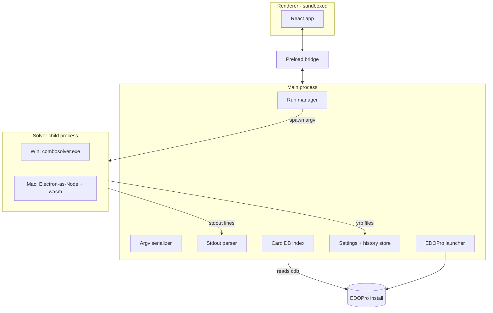
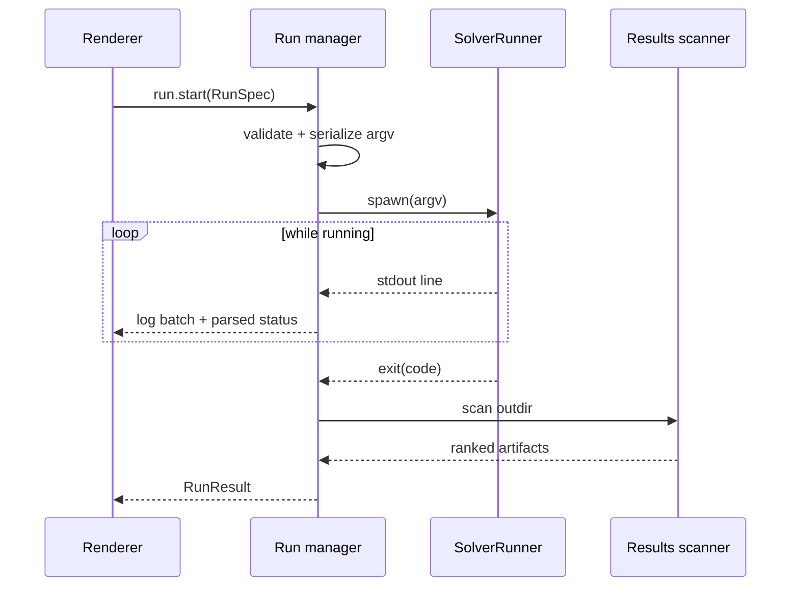

# TDD: ygo-combo-solver GUI

| Status | Author | Date | Tracking | Related |
| --- | --- | --- | --- | --- |
| Draft | Andy (with Claude) | 2026-08-30 | [YGO-12](https://linear.app/ygo-combo-solver-gui/issue/YGO-12/write-tdd-for-the-gui-architecture-solver-runner-parser-storage) | [PRD](./PRD.md) |

## 1. Overview

This document specifies the technical design for the GUI described in the [PRD](./PRD.md). It covers the Electron process architecture, the solver-runner abstraction that hides the native-exe (Windows) vs wasm-on-Node (macOS) split, argument serialization, the stdout parser contract, the card database index, storage schemas, project layout, packaging, and testing. It is detailed for milestones M0–M2, design-level for M3, and gives pointers for M4.

Design principles, restated from the PRD:

1. The solver is a black box driven over its CLI surface: spawn → stream stdout → enumerate output files. No solver logic in the GUI.
2. Parsing solver text is presentation-only. A parser miss degrades the status display, never the run.
3. One code path for both platforms above the `SolverRunner` interface.
4. The GUI is never less capable than the terminal: generated argv is always visible, and extra arguments pass through verbatim.

## 2. Stack

| Layer | Choice | Rationale |
| --- | --- | --- |
| Shell | Electron (current LTS line) | Bundles Node → runs the solver's wasm Node target on macOS (the deciding argument, PRD §7.2); mature two-platform packaging |
| Language | TypeScript everywhere (main, preload, renderer, shared) | One language, shared types across IPC |
| Build | electron-vite | Standard main/preload/renderer pipeline, HMR for the renderer |
| UI | React 18 | Boring and well-trodden; the app is forms + lists + a log pane, so ecosystem beats footprint. (Preact via `preact/compat` is a drop-in swap if bundle weight ever matters — it doesn't for a desktop app.) |
| State (renderer) | zustand | Tiny store for run status/log/history; no server-state machinery needed |
| SQLite | better-sqlite3 | Synchronous read-only queries in the main process; prebuilt Electron binaries via `prebuild-install`. Fallback if native-module packaging bites: sql.js (wasm, slower load, zero native deps) |
| Unit tests | vitest | Fast, TS-native |
| Packaging | electron-builder | NSIS installer (Windows), DMG (macOS) |
| Lint/format | eslint + prettier | Defaults |

No ORM, no app database, no telemetry, no auto-update in v1 (update = download new installer; revisit post-v1).

## 3. Process architecture



- **Renderer**: UI only. `contextIsolation: true`, `nodeIntegration: false`, `sandbox: true`, no remote content, strict CSP. It never touches the filesystem, never constructs solver commands, and receives everything through the preload bridge.
- **Preload**: exposes a typed `window.api` via `contextBridge` (§8). The IPC surface is the only boundary the renderer sees.
- **Main**: owns all Node capabilities. Every module below lives here.
- **Solver child process**: one per run, fully isolated; killing it cannot take the app down. Same lifecycle and stream surface on both platforms (§5).

## 4. Run pipeline

A run moves through: `configuring → validating → running → finished | failed | stopped`.



Key decisions:

- **One run at a time.** The solver saturates all cores by default; concurrent runs would thrash each other. The run manager rejects `run.start` while a run is active. No queue in v1.
- **Validation before spawn** (mirrors PRD §5.2.2): paths exist; `--deck` and `--start` mutually exclusive; budget ≥ 1s; workdir passes the health check (§9.1). Validation failures return structured errors to the form, no process is spawned.
- **Stopping**: renderer asks, main shows the "in-progress results will be lost" confirmation state, then kills the child (`taskkill /pid /t /f` on Windows to catch the process tree; `SIGKILL` on macOS). Status becomes `stopped`; the outdir is still scanned (earlier phases may have written files).
- **Log transport**: child stdout/stderr are line-split in main, appended to `log.txt` unconditionally, and forwarded to the renderer in batches flushed every 50 ms (the solver's unbuffered stdout can emit fast). The renderer keeps a capped ring buffer (50k lines) in a virtualized list; the full log is always on disk.
- **Exit mapping**: `0` → finished; `2` → failed (usage error — a GUI serialization bug, surfaced loudly as such); `1` → failed (load/health, message from parser context); killed → stopped.

## 5. SolverRunner abstraction

The single seam between the GUI and the two solver deliveries.

```ts
// src/main/solver/runner.ts
export interface SolverRunner {
  /** Spawn a run. argv excludes the program itself. */
  start(argv: string[], opts: { cwd: string }): RunHandle;
  /** Where this runner's solver came from, for display + history. */
  describe(): { kind: 'native' | 'wasm'; path: string; solverCommit: string };
}

export interface RunHandle {
  onLine(cb: (stream: 'out' | 'err', line: string) => void): void;
  onExit(cb: (code: number | null, signal: string | null) => void): void;
  kill(): void;
  readonly pid: number;
}
```

### 5.1 NativeRunner (Windows)

`child_process.spawn(exePath, argv, { cwd, windowsHide: true })`. Never `shell: true` — argv is always an array, which sidesteps Windows quoting entirely. `exePath` defaults to the bundled `resources/solver/win/combosolver.exe`, overridable in settings (PRD §5.2.1).

### 5.2 WasmRunner (macOS)

Runs the solver's emscripten Node target (`NODERAWFS`) — which reads real card DBs/scripts/replays from disk with the identical CLI (proven by the solver's `web` branch, PRD §7.4) — inside a Node child process:

```
spawn(process.execPath, [runnerScript, ...argv], {
  env: { ...process.env, ELECTRON_RUN_AS_NODE: '1' },
  cwd,
})
```

`ELECTRON_RUN_AS_NODE=1` makes the Electron binary act as plain Node, so we ship no separate Node runtime. `runnerScript` (bundled, ~30 lines) does:

```ts
const createSolver = require('./combosolver.js'); // emscripten glue, -sMODULARIZE
const mod = await createSolver({
  print: (s) => process.stdout.write(s + '\n'),
  printErr: (s) => process.stderr.write(s + '\n'),
  onExit: (code) => { process.exitCode = code; },
});
mod.callMain(process.argv.slice(2));
```

Notes:

- Threads: the emscripten build uses `-pthread` on Node `worker_threads`; pool size is baked at build time (`-sPTHREAD_POOL_SIZE`), so the wasm artifact is built with a generous pool and the GUI passes `--threads n` at or below it.
- Memory: build with `-sALLOW_MEMORY_GROWTH=1 -sMAXIMUM_MEMORY=4GB`. The GUI caps macOS presets so `arena-mb × threads + tt-mb` stays under the ceiling (PRD §9).
- stdout: on the Node target, `print` callbacks arrive line-wise already; the browser buffering gotcha from the web branch does not apply.
- Kill semantics match native: SIGKILL the child; worker threads die with it.
- `describe().solverCommit` is read from a `manifest.json` written next to each bundled artifact at build time (§12), letting the UI and CI assert both platforms ship the same solver commit (PRD §9).

### 5.3 Runner selection

`process.platform === 'win32' ? NativeRunner : WasmRunner`, with a settings override (`solver.forceWasm`) for testing the wasm path on Windows (open question PRD §11.3 becomes a checkbox we can A/B).

## 6. Argv serialization

One module, `src/main/solver/argv.ts`, is the single source of truth mapping typed run specs to flags. The renderer's command preview is produced by main over IPC from the same function that will spawn — the preview can never drift from reality.

```ts
type RunSpec =
  | { kind: 'verify';    replay: string; common: Common }
  | { kind: 'optimize';  replay: string; common: Common }
  | { kind: 'deckhand';  replay: string; deck: string; hand?: CardRef[]; common: Common }
  | { kind: 'board';     replay: string; deck: string; hand?: CardRef[];
      targets: TargetSpec[]; boardAdd: TargetSpec[]; boardRemove: CardRef[]; common: Common }
  | { kind: 'fire';      replay: string; fire: CardRef[]; fireSpare?: CardRef[];
      oppHand?: CardRef[]; guards?: GuardSpec[]; common: Common };

interface Common {
  workdir: string;           // always passed as --workdir; env var never relied on
  scriptdirs?: string[];     // repeatable --scriptdir
  outdir: string;
  solveMs?: number; threads?: number; seed?: number;
  extraArgs?: string;        // appended verbatim, last
}

interface CardRef { passcode: number; displayName: string } // picker output; always passcode
```

Serialization rules:

- Card references serialize as **passcodes, never names** — the picker resolved them (PRD §5.2.3), so the solver's ambiguity errors are structurally unreachable from forms.
- Grammar assembly (`card@zone:fd`, `n:clause|clause`, `card:attr`) is centralized here with exhaustive unit tests against the solver README's documented examples.
- `extraArgs` is tokenized by a small shlex-style splitter (quotes honored, no shell interpolation) and appended after generated flags. Conflicts with generated flags are the user's responsibility; the UI shows the final argv so conflicts are visible before launch.
- Positional replay path first, then flags, deterministic order — so history entries and tests compare argv arrays stably.

## 7. Stdout parser

`src/main/solver/parser.ts` — a line-oriented state machine, pure function of the line stream, emitting best-effort events:

| Event | Trigger (line shape) | UI use |
| --- | --- | --- |
| `phase` | `--- section ---` markers, `loading`, `results` headers | Status header: current phase |
| `health` | `MSG_RETRY : n`, `self-checks : pass/…` | Green/red banner (PRD §5.2.4) |
| `inert` | lines containing `!! INERT` | Warning chips on the run view |
| `seed` | `seed: N  (--seed N to replay)` | Shown post-run for reproducibility |
| `ladderRow` | discrepancy-table rows (rung, solutions, states, time) | Progress: rung k of `--max-ecarts` |
| `lineCost` | reference-cost table rows | Baseline vs solutions comparison |
| `solutionCount` | `N line(s) reaching the board…`, `N replay(s) written…` | Live "found so far" counter |
| `fireVerdict` | `=== --fire verdict: …` | Interruption-test result panel |
| `error` | `!! …` fatal lines | Failure explanation on exit 1/2 |

Contract:

1. **Never throws.** Unrecognized lines produce no event and are still logged. A format change downgrades the status display to "running (see log)" — the run completes regardless (PRD §5.2.4, risk §9).
2. Patterns are anchored to the most stable parts of the output (section markers, `MSG_RETRY`, `!! ` prefixes) and tolerate the known French residue (`but_rejete_`, `respectee`/`VIOLEE`, etc.).
3. The parser is versioned against a solver commit: `tests/fixtures/logs/<solver-commit>/*.txt` holds real captured runs (verify, optimize, deck, board, fire, failure cases); vitest replays fixtures and snapshots the event stream. Bumping the bundled solver requires re-capturing fixtures — a CI-enforced pairing.
4. Progress is phase + elapsed/budget + ladder rows, never a fabricated percentage. Between ladder rows (e.g. a silent 240 s finisher) the UI shows elapsed time only.

## 8. IPC contract

Defined once in `src/shared/ipc.ts`, implemented by preload; all payloads are structured-cloneable plain objects.

| Channel | Direction | Shape |
| --- | --- | --- |
| `settings:get` / `settings:set` | invoke | `Settings` (§10.1) |
| `workdir:probe` | invoke | `path → WorkdirHealth` (§9.1) |
| `cards:search` | invoke | `{ query, limit } → CardHit[]` |
| `run:preview` | invoke | `RunSpec → { argv: string[], display: string }` |
| `run:start` / `run:stop` | invoke | `RunSpec → runId` / `runId → void` |
| `run:event` | main→renderer push | `{ runId, logBatch?, status?, parserEvents? }` |
| `history:list` / `history:get` | invoke | run summaries / full `RunRecord` |
| `results:open` | invoke | `{ runId, file, action: 'edopro' \| 'reveal' \| 'useAsInput' }` |
| `dialog:pickFile` | invoke | scoped file pickers (replay, ydk, directory) |

Renderer never receives raw paths to write, only to display; all writes happen in main.

## 9. EDOPro integration

### 9.1 Workdir probe

`workdir:probe` validates a candidate EDOPro directory and powers first-run setup (PRD §5.2.1):

- `cards.cdb` exists and is non-empty (empty = missing, mirroring solver behavior), or `expansions/`/`repositories/` contain `.cdb` files (recursive).
- At least one script root resolves (`repositories/*/script`, `expansions/script`, `script`).
- EDOPro executable found (`EDOPro.exe` on Windows; `EDOPro.app` on macOS) — needed for §9.3, non-fatal if absent.

Auto-detection tries the platform-conventional install locations (e.g. `C:\ProjectIgnis`, `~/ProjectIgnis`) before asking.

### 9.2 Card DB index

On startup (and on workdir change), main collects `.cdb` paths in the solver's documented order (`cards.cdb`, then recursive `expansions/`, `repositories/`), opens each read-only with better-sqlite3, and runs the same two queries the solver runs (`datas` id/alias/type…, `texts` id/name/desc). It builds one in-memory index:

- Canonicalization mirrors the solver: `alias` maps artwork variants to one canonical code; the picker shows canonical entries.
- `cards:search` does normalized case/diacritic-insensitive substring match, ranked prefix-first then by name length; returns `{ passcode, name, typeline, isExtraDeck }` for the picker rows.
- ~14k cards × a few fields is a few MB — no persistence, rebuilt in well under a second; a file-watcher is not needed (re-probe on app start or manual refresh suffices).

### 9.3 Open in EDOPro

EDOPro lists replays from `<workdir>/replay/`. "Open in EDOPro" therefore: copy the `.yrp` into `<workdir>/replay/` under a collision-safe name (`gui_<runId>_<original>.yrp`), then launch the EDOPro executable; the user picks it from EDOPro's replay list. (If investigation during M1 finds a working replay CLI argument or file association, upgrade to direct-open; the copy step stays either way so the replay persists in EDOPro.) "Reveal" uses `shell.showItemInFolder`.

## 10. Storage

All under `app.getPath('userData')`, plain JSON with a `version` field for forward migration. No database.

### 10.1 `settings.json`

```json
{
  "version": 1,
  "workdir": "C:/ProjectIgnis",
  "scriptdirs": [],
  "solver": { "nativePath": null, "forceWasm": false },
  "defaults": { "solveMs": 120000, "threads": null, "outdirMode": "perRun" }
}
```

### 10.2 Run history — `runs/<runId>/`

`runId` = `<ISO-timestamp>-<short random>`. Each run folder is self-contained:

```
runs/2026-08-30T21-40-00-a1b2/
  run.json        # RunRecord below
  log.txt         # full stdout+stderr
  solutions/      # default outdir (user-overridable per run)
```

```json
{
  "version": 1,
  "spec": { "kind": "optimize", "...": "the RunSpec, verbatim" },
  "argv": ["duel.yrpX", "--workdir", "..."],
  "solver": { "kind": "native", "solverCommit": "fd5d30e" },
  "startedAt": "...", "endedAt": "...",
  "outcome": "finished",
  "exitCode": 0,
  "seed": 888,
  "summary": { "solutions": 2, "bestBurned": 1, "bestActions": 9, "msgRetry": 0 },
  "artifacts": [
    { "file": "solution_00_b1_a9.yrp", "kind": "solution", "rank": 0, "burned": 1, "actions": 9, "alt": false }
  ]
}
```

`spec` verbatim is what makes "duplicate run" (PRD §5.2.6) trivial: reload the form from it. `history:list` reads only the `run.json` headers, newest first; no index file to corrupt. Retention: keep everything; add a "clear old runs" action in settings (logs are the only thing that grows).

### 10.3 Results scanner

Post-exit, scan the run's outdir and classify by filename (authoritative — the names are produced by the solver's own `printf` patterns):

| Regex | Kind |
| --- | --- |
| `^solution_(\d+)_b(\d+)_a(\d+)(_alt)?\.yrp$` | solution (rank, burned, actions, alt-goal) |
| `^best_approach_(\d+)of(\d+)\.yrp$` | partial approach (n of k board cards) |
| `^best_joint_(\d+)r_(\d+)of(\d+)\.yrp$` | joint line |
| `^but_rejete_(\d+)_(retry\|constraint\|board)\.yrp$` | rejected witness, with reason |

Solutions sort by `(burned, actions)` ascending — the solver's own cost order. Anything unmatched is listed under "other files" rather than hidden.

## 11. Project structure

```
src/
  main/
    index.ts             # app lifecycle, window, IPC registration
    solver/
      runner.ts          # SolverRunner interface + selection
      native-runner.ts
      wasm-runner.ts     # + runner-script.cjs (child entry)
      argv.ts            # RunSpec → string[] (single source of truth)
      parser.ts          # stdout state machine
      results.ts         # outdir scanner
      run-manager.ts     # lifecycle, one-run gate, log fanout
    edopro/
      probe.ts           # workdir health
      carddb.ts          # cdb index + search
      launcher.ts        # open-in-EDOPro
    store/
      settings.ts
      history.ts
  preload/index.ts       # contextBridge api
  renderer/              # React app: views per workflow, log pane, results, history
  shared/
    ipc.ts               # channel names + payload types
    types.ts             # RunSpec, RunRecord, CardHit, ...
resources/
  solver/win/combosolver.exe + LICENSE + NOTICE + manifest.json
  solver/wasm/combosolver.{js,wasm} + manifest.json
tests/
  fixtures/logs/<solver-commit>/*.txt
  fixtures/cdb/mini.cdb  # tiny synthetic card DB for picker tests
```

## 12. Solver artifact pipeline

- Artifacts are **not** checked into git. A `scripts/fetch-solver.ts` step downloads pinned artifacts (URL + sha256 in `solver.lock.json`) into `resources/solver/` before packaging; CI fails if the two platforms' `manifest.json` solver commits differ (PRD §9).
- Where artifacts are *built* (solver-repo releases vs a workflow here) is PRD open question §11.4 — the lockfile decouples this TDD from that answer.
- The wasm artifact is built from the solver's `web` branch rebased onto master (`build_wasm.ps1 -Target node`, LTO, generous `PTHREAD_POOL_SIZE`); blocked on the branch being pushed ([YGO-7](https://linear.app/ygo-combo-solver-gui/issue/YGO-7)).

## 13. Packaging and CI

- electron-builder: NSIS (x64) for Windows; DMG (arm64 + x64, or universal) for macOS with hardened runtime + notarization. Solver `LICENSE`/`NOTICE` are installed alongside the app and linked from an About screen (AGPL compliance, PRD §9; final licensing shape is open question §11.1, decided by M4).
- GitHub Actions: `lint+test` on every PR (ubuntu, no packaging); `package` matrix (windows-latest, macos-latest) on tags — fetch-solver, build, sign, upload artifacts.
- Native-module note: better-sqlite3 is rebuilt for Electron's ABI by electron-builder's install-app-deps; if this proves brittle in CI, the sql.js fallback (§2) removes native modules entirely.

## 14. Testing strategy

| Layer | How |
| --- | --- |
| argv serializer | vitest: every workflow spec ↔ expected argv, including grammar assembly cases lifted from the solver README's 14 task examples |
| parser | fixture replay + event-stream snapshots per pinned solver commit (§7.3) |
| results scanner | filename corpus incl. `_alt`, rejected, joint, unmatched files |
| card DB | synthetic `mini.cdb` fixture: alias canonicalization, ranking, diacritics |
| run manager | mock `SolverRunner` (scripted line/exit emitter): lifecycle, one-run gate, stop, log batching |
| End-to-end | manual matrix per release (both OSes, the five MVP workflows against a real EDOPro install + known replays); optional Playwright-Electron smoke test post-v1 |

The mock-runner tests mean 90% of the app is testable on any platform with no solver binary present.

## 15. Risks and open items

| Item | Handling |
| --- | --- |
| `ELECTRON_RUN_AS_NODE` + emscripten pthreads (`worker_threads`) interaction | Prove in an M3 spike before building the full WasmRunner; fallback is bundling a real Node binary (adds ~40 MB, changes nothing else) |
| wasm `PTHREAD_POOL_SIZE` baked at build time | Build with pool = 32; GUI clamps `--threads` to min(cores, 32) |
| EDOPro direct-open CLI arg unknown | M1 investigation; copy-to-replay-folder design works regardless (§9.3) |
| better-sqlite3 packaging friction | sql.js fallback held in reserve (§2, §13) |
| Parser fixtures drift from bundled solver | CI pairs `solver.lock.json` commit with fixtures directory name; mismatch fails the build |
| macOS solver perf (0.88× native, wasm) | Acceptable per PRD; revisit only with the native mac port (PRD §7.4) |
